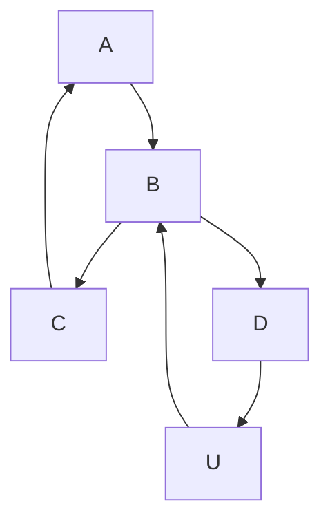

# PORTABLE-ECG
A Handheld ECG Machine with Mobile phone and Laptop interface. Cardiac condition prediction using ML

## P-ECG MACHINE

In the prediction feature, patient's ECG signal is compared with various cardio gram.
as the processing result the machine filter out many heart disease and predicts the most probable disease that should affect the person's life'

## BLOCK DIAGRAM
~~~mermaid

graph LR 
 
    PWR[POWER SUPPLY]-->CHR[CHARGING CIRCUIT]
    RGL[POWER REGULATOR]-->OLED[OLED 128*64]
    CHR--> RGl
    RGL-->UC 
    UC[MICROCONTROLLER]-->OLED
    RGL-.->INS
    INS[INSTRUMENTATION AMPLIFIER] ---> UC
~~~

~~~mermaid
graph TD 
   I((IDEATION)) --> Q[PREPARE FAQ] 
    I --> D[CONSTRAINTS IN NEW IMPLEMENTATION]
    D-->M[ MEASURES TAKEN ]
    EX[IDENTIFYING EXISTING TECHNOLOGY]-->I
    FL[IDENTIFYING LIMITATIONS]-->I
    
~~~
~~~mermaid
graph TD
    H[COMPONENTS SELECTION]-->SCH[PREPARE SCHEMATICS]
    SCH-->PCB[DESIGN PCB LAYOUT]
   DSN[CHASY DESIGN]-->TST[TESTING STAGE]
    TST-.->|FAIL|SCH
    TST==>|SUCCESS|FINAL((PRODUCT))
    PCB-->DSN

~~~